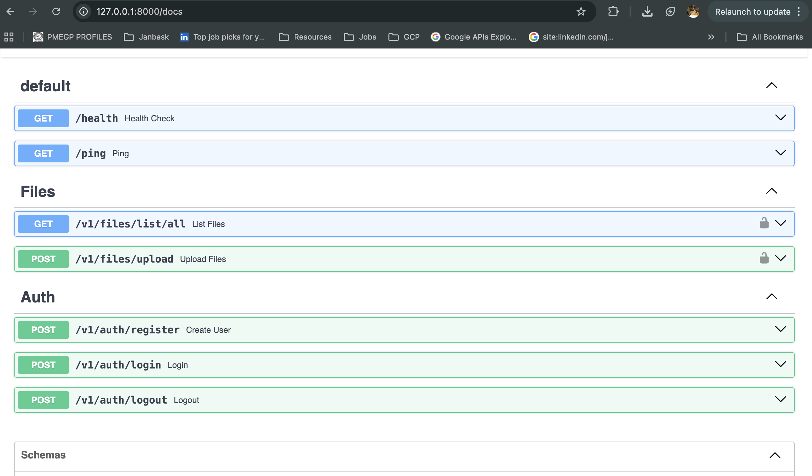

# DriVault (Drive-Vault) : 

The goal for creating a vault so that memories can be seen and shared with other people
in family without any disruptions and problems. In the world of technology where Internet is somewhat affordable its hard to share the content between the family in different memory locations.

## Problems

- GDive only gives free **15 GB**  drive to store you contents.
- There are also other thrid-party service available where you can store the contents but
there are security concerns as well.

## Solutions:

- **DriVault** Server will provide the access to the file contents present in the folder/path to the user (family). People from different geo-locations can access these files through the internet without any extra money or privacy concerns.

## Tech-Stack

- Backend : Python, FastAPI
- Frontend : Javascript, React
- Database : Postgres, TortoiseORM
- Other Tools : RabbitMQ, Docker, **FFMPEG**

> Note: BE is done and all the APIs are done except one for streaming. FE part is in-progress.

### Swagger APIs

